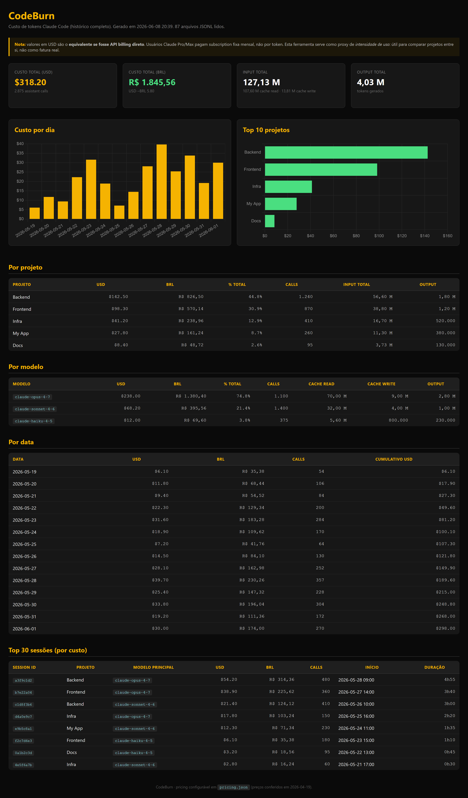

# CodeBurn

> [English](README.md) · [Português](README.pt-BR.md)

A simple dashboard to see how many tokens your Claude Code is burning, project by project.

It reads the session logs that Claude Code already writes on your machine, estimates the equivalent cost in dollars and generates an HTML page with tables and charts. Everything local. Nothing leaves your computer.

  



*Example with demo data.*

## First things first: this is not your bill

If you use Claude Pro or Max, you pay a fixed monthly subscription, not per token. The dollar figures shown here are the equivalent as if you were paying through the API. Use it as a gauge of usage intensity, great for comparing one project against another and seeing where your consumption is concentrated. Do not treat it as an invoice.

## How it works

Claude Code stores each session in `.jsonl` files inside `~/.claude/projects/`. CodeBurn scans those files, adds up the tokens of each call (input, cache read, cache write, output), applies the price table and groups everything by project, model, day and session.

The first run builds a local cache so the next ones are fast. As you keep using Claude Code, just run it again to refresh.

## Requirements

- **Python 3.10 or newer.** On older versions it will not even start.
- No extra libraries. Just the Python standard library.
- Internet connection to render the charts (they use Chart.js via CDN). The tables work offline.

## Usage

Clone or download the folder, go into it and run:

```bash
python codeburn.py
```

This generates `report.html` next to the script. Open it in your browser and you are done.

Other options:

```bash
python codeburn.py --days 7          # last 7 days only
python codeburn.py --open            # generate and open in the browser
python codeburn.py --json out.json   # also export the data as JSON
```

## Make it yours

**Group by project.** Open `codeburn.py` and edit the `PROJECT_RULES` list at the top. Each line is a pair: an expression that matches the folder path, and the name you want to see in the report. The first match wins. If nothing matches, the report uses the folder path itself as the name. The examples that ship with the file (Frontend, Backend, Infra) are just a starting point, swap them for yours.

**Adjust the prices.** The table lives in `pricing.json`. Check the current values on the [Anthropic pricing page](https://www.anthropic.com/pricing) and update if needed. The dashboard footer shows the date the prices were last checked, so you always know how fresh they are. There is also a `usd_brl` field to convert to another currency.

## Privacy

CodeBurn runs entirely on your machine and reads only your own logs. It does not send anything anywhere. The only thing that goes over the network is loading the chart library (Chart.js) from a public CDN, and that is code, not your data.

To guess each session's project name, CodeBurn reads the text of your conversations locally. That text never leaves your machine: it is used only for classification and discarded right after. No conversation content is written to the report or transmitted.

The generated `report.html` contains your project names and your usage. The `.gitignore` is already set up so you do not push that report or the cache by accident, in case you version your own copy.

## License

MIT. Use it freely.
